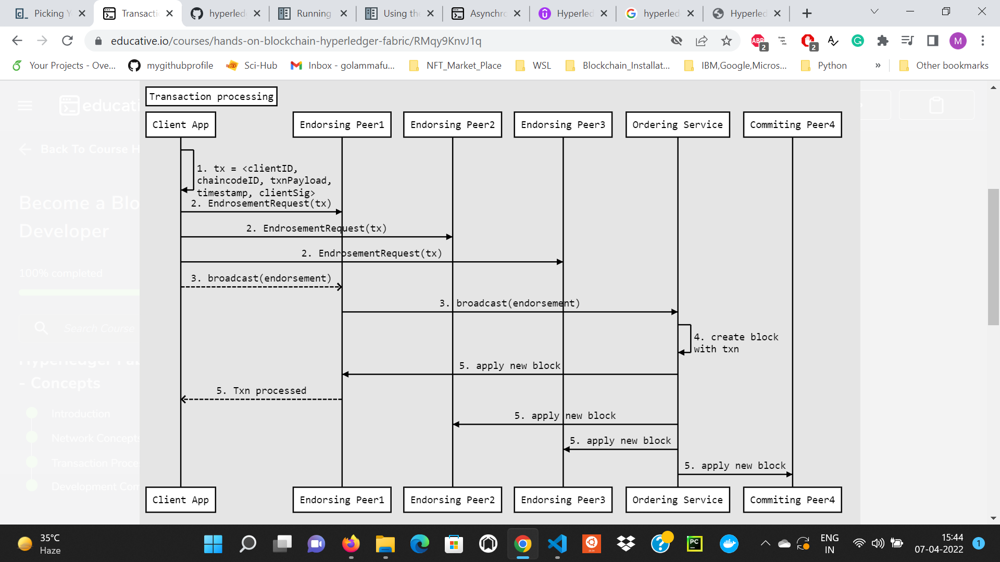
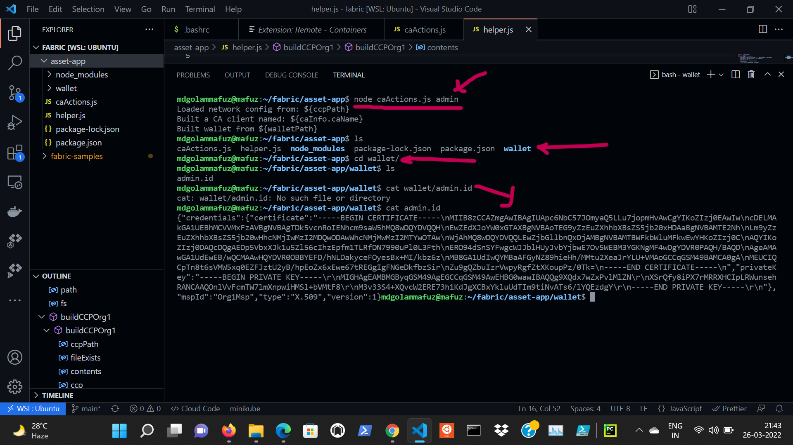

# Asset Registry with Hyperledger Fabric 2.3+

**Our Goal** : In this project we are going to implement simple asset registry where we are going to have some assets and, those assets are going to be transferred, created or destroyed. In our example there are **two organizations** and **one orderer**.

## Hyperledger Fabric 2.3+ Setup

Make sure we are using the bash shell. If we are using `fish` or `zsh`, just enter the following command to enter the bash shell

```
$ bash
```
### **Setting up the Environment**
Let’s first go ahead and setup **docker** and some **prerequisites**

```
$ sudo apt install git curl jq 
$ sudo apt-get -y install docker-compose
$ docker --version 
$ sudo systemctl start docker
$ sudo systemctl enable docker 
$ echo $USER    # ensure your username shows here 
$ sudo usermod -a -G docker $USER
```

Make sure to log out and log back in to ensure correct permissions are set for the user. Otherwise, docker gives errors.

```
$ docker ps 
```
If that works correctly i.e. does not throw any errors, we may proceed. Otherwise, first setup the permissions through usermod above.

Let’s now setup **node**. The latest supported version should be mentioned on the Fabric site.

```
$ curl -fsSL https://deb.nodesource.com/setup_12.x | sudo -E bash - 
$ sudo apt update 
$ sudo apt-get install -y nodejs  
```
Ensure that correct versions of Node and NPM are installed

```
$ npm  --version     
$ node --version   
```
### **Downloading and Installing Fabric Binaries**

Let’s first create a fabric directory to ensure everything remains in one place

```
$ mkdir ~/fabric 
$ cd fabric 
```
Let’s download the Fabric binaries in this folder

```
$ curl -sSL https://bit.ly/2ysbOFE | bash -s -- 2.3.1 
```
 

This will clone the repo and setup docker images using Docker Compose

## ***Hyperledger Fabric: Basic Concepts***

### **High Level Architecture**

* **Blockchain technology** is also referred to as **Distributed Ledger Technology**, or **DLT**, as it works on a **ledger** that is distributed on **multiple peers**. 
<br/>

* Hyperledger fabric is ideal for building a **permissioned**, **private** blockchain business network. By **private**, it means that it should not be publicly open for everyone to run a peer or transact on the network. Enterprises need more control on their data access policies. They also need a **permissioned** network so they can implement access control as per their own requirements.
<br/>

* **High Level Architecture**: The permission issuer issues or revokes permissions for all participants and infrastructure components of the network. This permission or access control in Fabric is based on **X509 PKI** infrastructure. Which means there is a trusted certificate authority that issues certificates to all participants.
<br/>

    
<br/>

### **The concept of Network**

* **Multiple organizations** can form a **network**
<br/>

    
<br/>

#### **MSP (Membership Service Provider)**
 Each organization can have its own **membership services provider** which will issue and revoke identities for users and peers of that organization. This membership service provider can be a **certificate authority hierarchy or a single root certificate authority**. In order for other organizations to validate transactions by each other, they need to be set up by having trusted root certificate authorities pre-configured on them in something called an MSP (Membership Service Provider).
<br/>


<br/>

#### Channels
 In fabric there is a concept of **channels**. Each peer can join one or more channels. If there are some special transactions that need to be shared only by org1 and org2 and they don’t want any peer from org3 to read it, both the organizations can join a separate channel and be present on the main channel as well. **This provides privacy that does not exist in public blockchains**. **Internally a separate ledger is maintained on each peer for each channel that it is on**.
<br/>


<br/>

#### **Ledger**

Each peer maintains a ledger. A ledger is essentially two things:

* Timestamped transactions organized in blocks and stored
 
* A State Database which is the computed outcome of all transactions executed in order

By having a **state database** it is easier to query the ledger as the current state is pre-calculated and stored on each peer.

The state database is essentially a key value based datastore(an instance of Apache CouchDB). The state database contains the final state of the ledger after applying all transactions recorded in blockchain. It is therefore like a cache. It helps make querying the blockchain faster, as the state is pre-calculated. It also gives developers an easier programming model to work with. Developers writing chaincode do not need to write transactions directly on blockchain, but rather, write to state in state database (the required transactions are generated under the hood).

The peers communicate with each other to ensure their final state is the same at all times using the **gossip protocol**.
<br/>

#### **Chaincode**

**This is a piece of code that is part of the ledger**. The chaincode provides logic on what, how, when, and by whom things can be written on ledger. It is essentially business rules coded to store data onto the ledger. For example the chaincode can make sure an account holder has enough balance before he transfers an amount to another account.
<br/>

#### **Ordering Service**

**Ordering Service** is a **distributed (solo in dev mode) service** that is responsible for **organizing endorsed transactions into sequenced blocks and distributing to all peers**. This service is run on multiple nodes. Typically each org will have at least one node of ordering service to ensure they are a part of the end to end transaction processing.

<br/>

### **Transaction Processing**

Let's take a look at high-level steps carried out in transaction processing. Below is the list of high-level steps being carried out when a transaction needs to be applied to the ledger

* Client App prepares the transaction signed by the user
* Client App connects to endorsing peers(as per endorsement policy) to collected signed endorsements on the transaction output. The peers simulate the transaction and return a signed endorsement
* Client App submits the endorsed transaction to ordering service, which puts it into a valid block and distributes to all peers
<br/>

    

<br/>

### **Developement Components**

There are 3 main development components for a basic end-to-end development flow: 

* Configure a `dev network`
* Write and deploy `chaincode` on the `dev network`
* Write application code that can invoke chaincode transactions on dev network
<br/>

    
    <br/>

    
    <br/>

    
    <br/>

    

<br/>

### **Understanding Docker**

* Hyperledger Fabric forms a distributed network and in order to run on a single machine, **we use docker containers to run individual distributed components**. Each component runs in a separate container instance and connects to other containers to form a network.
<br/>

* A **Docker container image** is a lightweight, standalone, **executable package of software that includes everything needed to run an application: code, runtime, system tools, system libraries and settings**. Understanding docker and docker-compose is crucial to understanding the dev environment we will use in this course.
<br/>

* Please visit the following links to get a basic knowledge about docker: [What Is Docker And How It Works?](https://www.youtube.com/watch?v=rOTqprHv1YE) and [Make a Local Docker Container for php](https://www.youtube.com/watch?v=YFl2mCHdv24&t=359s)
<br/>

* For development purposes we will run a small network on our machine in docker containers called **basic-network** and which is provided in official hyperledger fabric-samples repo  (**link**: https://github.com/hyperledger/fabric-samples)

<br/>

### ***Components of Network***
The components of a basic network are:
#### PEER

* **peer container**: Runs the peer node
* **couch db container**: Stores the state database of peer node

#### ORDERER

* **orderer container**: Solo orderer node to keep dev environment simple. In a real-world network the ordering service is distributed with multiple nodes communicating with each other

#### CERTIFICATE AUTHORITY

* **fabric-ca container**: root certificate authority for issuing membership certificates to all nodes and users. Since we will use single CA, our network is comprised of a single org called **“example dot com”**

#### TOOLING

* **fabric-cli container**: This container has some cli tools that help us interact with network nodes to deploy chaincode etc

## ***Setting up the Test Network***

* First, create a **channel** on which our **chaincode** (or **smart contract**) will be deployed

```
$ cd fabric-samples/test-network 
$ ./network.sh up createChannel -c channel1 -ca 

```

* Verify that new **containers** are indeed up

```
$ docker ps 
```


* To create a package for our chaincode, first, let's set up the dependencies 

```
$ cd ../asset-transfer-basic/chaincode-javascript 
$ npm install 

```


* Go to the `test network` folder and export the environment variable

```
$ cd ../../test-network 
$ export FABRIC_CFG_PATH=$PWD/../config/ 
$ echo $FABRIC_CFG_PATH 
```


* Now, we must make sure that fabric commands are in the `PATH`. The following commands adds it to the current session but we should add it to our `~/.bashrc` file as well for future use

```
$ peer   # ensure it's there. If not, set the path 
$ export PATH=$PATH:/home/mdgolammafuz/fabric/fabric-samples/bin/ 
peer   # should work now

```

* Now, let’s create a pacakge from our chaincode source

```
$ peer lifecycle chaincode package basic.tar.gz \
      --path ../asset-transfer-basic/chaincode-javascript \
      --lang node \
      --label basic_1.0

```


## ***Installing the Chaincode to Channel***

* Set the environment variables needed through the provided script

```
$ source ./scripts/envVar.sh 
```


*  Select the first organization
```
setGlobals 1 
```
* Save the certificate file locations for both organizations and the orderer

```
# the $PWD is necessary as the commands need absolute paths, relatives don't work 

$ export ORDERER_CERTFILE=$PWD/organizations/ordererOrganizations/example.com/orderers/orderer.example.com/msp/tlscacerts/tlsca.example.com-cert.pem

$ export ORG1_PEER_CERTFILE=$PWD/organizations/peerOrganizations/org1.example.com/peers/peer0.org1.example.com/tls/ca.crt

$ export ORG2_PEER_CERTFILE=$PWD/organizations/peerOrganizations/org2.example.com/peers/peer0.org2.example.com/tls/ca.crt

```

* Install the package

```
$ peer lifecycle chaincode install basic.tar.gz

```


* Repeat the same for Organization 2 and take note of the **Package ID** given back. We need this to refer to the chaincode in later commands.

```
$ setGlobals 2
$ peer lifecycle chaincode install basic.tar.gz 

$ setGlobals 1  # back to org1 

```

* Set the package ID env variable

```
# make sure you use the actual package ID and not copy/paste the one below 
 
$ export PKGID=basic_1.0-94c84bb2cc404bab2d945d62dc8d8d3837e2074966495d037b27ecfdf7fe171a

```
* Once we have that, we need to approve the chaincode definition for organizations

```
$ peer lifecycle chaincode approveformyorg \
      -o localhost:7050 \
      --ordererTLSHostnameOverride  orderer.example.com \
      --tls --cafile $ORDERER_CERTFILE  \
      --channelID channel1 \
      --name basic \
      --version 1 \
      --package-id $PKGID \
      --sequence 1  

```


* Do the same for the second organization

```
$ setGlobals 2 

$ peer lifecycle chaincode approveformyorg \
      -o localhost:7050 \
      --ordererTLSHostnameOverride  orderer.example.com \
      --tls --cafile $ORDERER_CERTFILE  \
      --channelID channel1 \
      --name basic \
      --version 1 \
      --package-id $PKGID \
      --sequence 1  


```

* Let’s commit the chnages made to the chaincode. We have to specify peers here explicitly

```
$ peer lifecycle chaincode commit \
      -o localhost:7050 \
      --ordererTLSHostnameOverride orderer.example.com \
      --tls --cafile $ORDERER_CERTFILE \
      --channelID channel1 --name basic \
      --peerAddresses localhost:7051 --tlsRootCertFiles $ORG1_PEER_CERTFILE \
      --peerAddresses localhost:9051 --tlsRootCertFiles $ORG2_PEER_CERTFILE \
      --version 1 --sequence 1  

```


* And confirm that it went through.

```
$ peer lifecycle chaincode querycommitted \
      --channelID channel1 --name basic \
      --cafile  $ORDERER_CERTFILE
```

* Finally, see `docker ps` to check if the chaincode containers running

`$ docker ps`


## How to Clean Everything

```
# See what stuff is avaialble 
$ docker images -a 
$ docker volume ls 

# Remove ALL the docker containers (Not just for fabric, ALL!!)
$ docker rm -vf $(docker ps -a -q) 

# .. and the images 
$ docker rmi -f $(docker images -a -q) 

# Volumes are not deleted by default 
$ docker volume ls 

# ... but we can get rid of those too 
$ docker system prune -a --volumes 

# Verify that everything is indeed gone 
$ docker volume ls 
$ docker images 
$ docker container ls 

# And just for final measure 
$ docker system prune --all 


# finally, get rid of the files as well. 
# Make sure you copy your code before doing this (if any)   
$ cd ~/fabric 
$ sudo rm -rf fabric-samples
```

## ***Interacting with the Smart Contract through Code*** 

* We will create a simple project based on the example provided in `fabric-samples/asset-transfer-basic/application-javascript`. Let’s start by creating a node project in our fabric folder.

```
$ cd ~/fabric/fabric-samples 
$ mdkir asset-app 
$ cd asset-app 

# initialize a node project 
$ npm init 

```

* Install the required packages in this project

```
$ npm install fabric-ca-client 
$ npm install fabric-network 

```


### Helper Functions

We need to first create some helper function to get the organization’s configurations

```javascript
exports.buildCCPOrg1 = function() { 
    const ccpPath = path.resolve(__dirname, '..', 'test-network', 
    'organizations', 'peerOrganizations', 'org1.example.com', 
    'connection-org1.json'); 

    const fileExists = fs.existsSync(ccpPath); 
    if(!fileExists) { 
        throw new Error("Cannot find: ${ccpPath}"); 
    }

    const contents = fs.readFileSync(ccpPath, 'utf8'); 

    const ccp = JSON.parse(contents); 

    console.log("Loaded network config from: ${ccpPath}"); 

    return ccp; 
}

```

We then create a function for creating a wallet. This wallet will hold the keys and other crypto material used througout the code. The wallet can store in-memory (for testing) or in a folder (which is what we will use)

```javascript 
exports.buildWallet = async function (Wallets, walletPath) { 
    let wallet; 

    if (walletPath) { 
        wallet = await Wallets.newFileSystemWallet(walletPath);     
        console.log("Built wallet from ${walletPath}"); 
    } else { 
        wallet = await Wallets.newInMemoryWallet(); 
        console.log("Build in-memory wallet"); 
    }

    return wallet; 
}

```

There’s also a function to pretty-print javascript. This is straight-forward.

```javascript

exports.prettyJSONString = function(inputString) { 
    return JSON.stringify(JSON.parse(inputString), null, 2);
}
```

### Performing Administrative Actions

There are some functions that will set up the admins and users. Logic for this is in the `caActions.js`. Let’s take a look at those here.

First function is to load the credentials used for performing actions.

```javascript
function buildCAClient(FabricCAServices, ccp, caHostName) { 
    const caInfo = ccp.certificateAuthorities(caHostName); 
    const caTLSCACerts = caInfo.tlsCACerts.pem; 
    const caClient = new FabricCAServices(caInfo.url, {
        trustedRoots: caTLSCACerts, verify: false 
    }, caInfo.caName); 

    console.log("Built a CA client named: ${caInfo.caName}"); 
    return caClient; 
};

```

This function will be called with the following information:

```javascript

let ccp = helper.buildCCPOrg1(); 

const caClient = buildCAClient(
                    FabricCAServices, 
                    ccp, 
                    'ca.org1.example.com'
                ); 

```

We also need to create an administrative account. This will be a onetime task. We first create the enrollment information along with its X.509 certificate. Then we put it in the wallet.

```javascript
async function enrollAdmin(caClient, wallet, orgMspId) { 
    // ... 
        
        const enrollment = await caClient.enroll({ 
            enrollmentID: adminUserId, 
            enrollmentSecret: adminUserPasswd
        }); 

        const x509Identity = { 
            credentials: {
                certificate: enrollment.certificate, 
                privateKey: enrollment.key.toBytes()
            }, 
            mspId: orgMspId, 
            type: 'X.509'
        }; 

        await wallet.put(adminUserId, x509Identity);
    // ... 
};

```

Creating an everyday user is similar but it’s done more often. We load the admin credentials, use those to create the user and save the user’s credentials in the wallet.

```javascript
async function registerAndEnrollUser(caClient, wallet, orgMspId, userId, affiliation){ 
    // ... 

    // Must use an admin to register a new user
    const adminIdentity = await wallet.get(adminUserId);

    // ... 

    // build a user object for authenticating with the CA
    const provider = wallet.getProviderRegistry().
                        getProvider(adminIdentity.type);
    const adminUser = await provider.getUserContext(adminIdentity, adminUserId);


    const secret = await caClient.register({
                          affiliation: affiliation,
                          enrollmentID: userId,
                          role: 'client'
    }, adminUser);

    const enrollment = await caClient.enroll({
      enrollmentID: userId,
      enrollmentSecret: secret
    });

    const x509Identity = {
      credentials: {
        certificate: enrollment.certificate,
        privateKey: enrollment.key.toBytes(),
      },
      mspId: orgMspId,
      type: 'X.509',
    };

    await wallet.put(userId, x509Identity);

    // ...
};

```

There are two more function `getAdmin` and `getUser` which are basically interfaces for the above two functions.

Finally, we have some helper code so that we can call these functions from the command line.

```javascript

let args = process.argv; 

if (args[2] === 'admin') { 
    getAdmin(); 
} else if (args[2] === 'user') { 
    let org1UserId = args[3]; 
    getUser(org1UserId); 
} else { 
    console.log("Invalid command");
}

```



### Performing Actions on the Ledger Itself

Once we have the users and admins, we can perform the actual chaincode logic. Logic for this is in the `ledgerActions.js`.

Relevant fragments of code are discussed here. First part is the connection information. Think of this as being similar to creating a database connection.

```javascript
const ccp = helper.buildCCPOrg1();
const wallet = await helper.buildWallet(Wallets, walletPath);
const gateway = new Gateway();

await gateway.connect(ccp, {
            wallet,
            identity: org1UserId,
            discovery: { enabled: true, asLocalhost: true }
        });

```
Then we establish the connection to the actual chaincode. Again, think of this as selecting a specific database from our connection.

```javascript
const network = await gateway.getNetwork(channelName);  // channel1 
const contract = network.getContract(chaincodeName);    // basic

```

Using the actual chaincode functions is no extremely easy. Simply call the relevant function like so:

```javascript
await contract.submitTransaction('InitLedger'); 

```

This function essentially calls the function in the chaincode. This can be seen as the `InitLedger` function in `fabric-samples/asset-transfer-basic/chaincode-javascript/lib/assetTransfer.js`.

The only difference is that since we are using `subimtTransaction`, this will go to the orderer and the whole voting and consensus algorithm will work and the transaction will be added to the blockchain. From a programming perspective, all of this is hidden behind this one simple function call.

Very similarly, we have the `GetAllAssets` and `ReadAsset` functions.

```javascript
let result = await contract.evaluateTransaction('GetAllAssets'); 
// ... 
let result = await contract.evaluateTransaction('ReadAsset', asset); 
// ...
let result = await contract.submitTransaction('CreateAsset', 
                                'asset101', 
                                'violet', 
                                '5', 
                                'Snnorre 3', 
                                '1300'); 

```                              
The file also has some code fragments that allow passing comments into the code. So, we can call it using the following commands.

```javascript
node ledgerActions.js GetAllAssets 
node ledgerActions.js ReadAsset asset1 
node ledgerActions.js CreateAsset 

```


<br/>

# References
<br/>

1. [Become a Blockchain Developer (A course on **edcucative.io**)](https://www.educative.io/courses/hands-on-blockchain-hyperledger-fabric)
<br/>

2. [Hyperledger Fabric 2.x - First Practical Blockchain: A course instructed by **Mohammad Nauman** on **Udemy**](https://www.udemy.com/course/hyperledger-fabric-composer-first-practical-blockchain/)
<br/>

4. [HYPERLEDGER FABRIC: Writing Your First Chaincode](https://hyperledger-fabric.readthedocs.io/en/release-2.2/chaincode4ade.html#)
<br/>

5. **Hands-On Smart Contract Development with Hyperledger Fabric V2**
by Matt Zand, Xun Wu, and Mark Anthony Morris
Copyright © 2021 WEG2G LLC. All rights reserved.
Printed in the United States of America.
Published by O’Reilly Media, Inc., 1005 Gravenstein Highway North, Sebastopol, CA 95472.